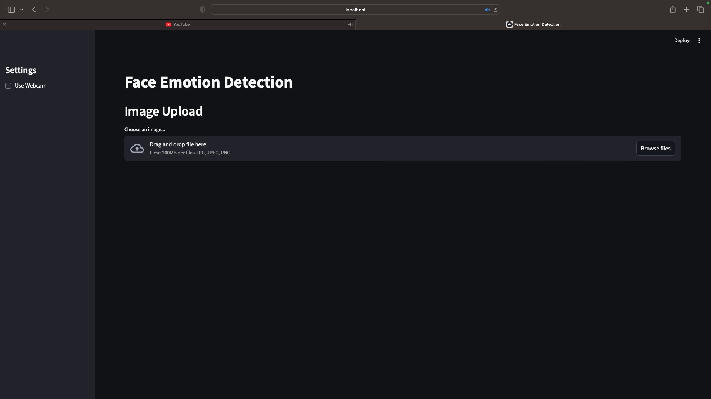

# Face Emotion Detection

A robust machine learning pipeline for real-time face emotion detection, capable of recognizing 7 emotions (Angry, Disgust, Fear, Happy, Sad, Surprise, Neutral) from images and Live camera.

## Features

- **Real-time Inference**: Uses MediaPipe for fast face detection and a custom-trained ResNet-18 for emotion classification.
- **Interactive UI**: Built with Streamlit for easy webcam testing and image uploads.
- **Modular Design**: Clean separation between data, training, and inference logic.
- **Reproducibility**: Includes configuration management and dependency tracking.

## App Interface

<p align="center">
  
</p>

## Results

The model demonstrates strong performance on various facial expressions. Below are some example detections from the test set:


<p align="center">
  
  
  
</p>
<p align="center">
  
  
  
</p>

## Project Structure

```
face_emotion_detection/
├── configs/            # Configuration files
├── data/               # Dataset storage
├── experiments/        # Trained models and logs
├── src/                # Source code
│   ├── data/           # Data loading and transforms
│   ├── models/         # Model definitions
│   ├── training/       # Training loop
│   ├── inference/      # Inference logic
│   └── ui/             # Streamlit app
├── scripts/            # Utility scripts (training, data download)
├── run_app.sh          # Helper script to launch the app
└── requirements.txt    # Python dependencies
```

## Installation

1.  Clone the repository:
    ```bash
    git clone <repo_url>
    cd face_emotion_detection
    ```

2.  Install dependencies:
    ```bash
    pip install -r requirements.txt
    ```

## Usage

### Running the App
The easiest way to start the application is using the helper script:

```bash
./run_app.sh
```

This will launch the Streamlit interface in your browser, where you can:
- Use your webcam for live emotion detection.
- Upload images to analyze emotions.

### Training (Optional)
If you want to retrain the model yourself:

1.  **Download Data**:
    The project uses the FER2013 dataset. You can download it using the provided script (requires Hugging Face access):
    ```bash
    python scripts/download_hf_data.py
    ```

2.  **Train**:
    ```bash
    # Train with default configuration (ResNet18)
    python scripts/train.py --config configs/default_config.yaml
    ```

## Models

- **ResNet-18**: The default model, offering a good balance of accuracy and performance.

## License
MIT
